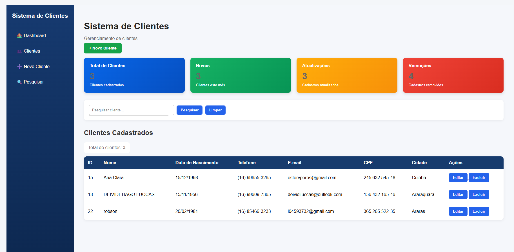

# Sistema de Clientes

Sistema web desenvolvido para gerenciamento de clientes, permitindo cadastrar, pesquisar, editar e excluir registros.

Este projeto foi desenvolvido como parte dos meus estudos de desenvolvimento web com Python, Flask e MySQL.
## 📸 Tela do Sistema

## 🚀 Funcionalidades

- Cadastro de clientes
- Edição de clientes
- Exclusão com confirmação
- Pesquisa de clientes
- Sugestões de nomes durante a pesquisa
- Validação de CPF duplicado
- Máscaras para CPF, telefone e data de nascimento
- Registro da data de cadastro
- Registro de atualizações
- Histórico de exclusões
- Dashboard com indicadores:
  - Total de clientes
  - Novos clientes
  - Clientes atualizados
  - Clientes removidos

## 🛠️ Tecnologias utilizadas

- Python
- Flask
- MySQL
- HTML
- CSS
- JavaScript
- Git
- GitHub

## 📂 Estrutura do projeto

Sistema_Clientes/
├── app.py
├── requirements.txt
├── templates/
│   ├── index.html
│   ├── novo_cliente.html
│   └── editar_cliente.html
└── static/
    └── css/
        └── style.css

## 🔐 Segurança

As credenciais do banco de dados são armazenadas em variáveis de ambiente utilizando um arquivo `.env`.

O arquivo `.env` não é enviado ao GitHub.

## ▶️ Como executar

Instale as dependências:

pip install -r requirements.txt

Crie um arquivo `.env` com as configurações do seu banco MySQL.

Depois execute:

python app.py

Acesse no navegador:

http://127.0.0.1:5000

## 👨‍💻 Autor

Desenvolvido por Deividi Luccas.