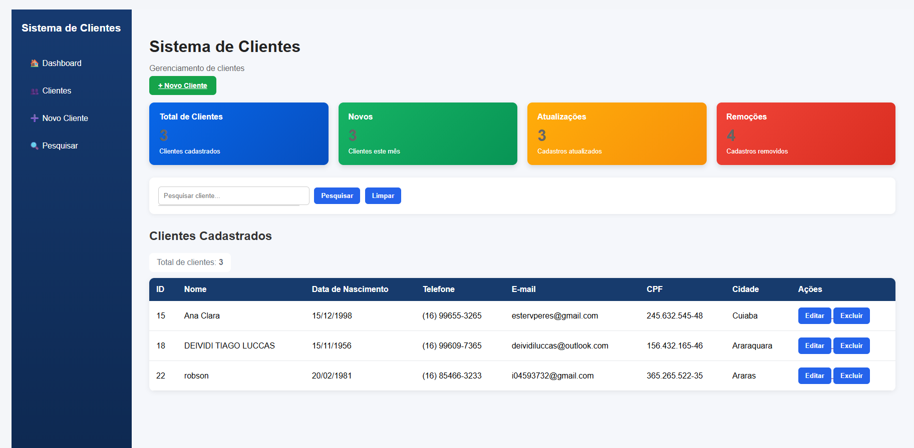

# Sistema de Clientes

[](https://github.com/DeividiLuccasdev/sistema-clientes-flask/actions/workflows/ci.yml)

Sistema web desenvolvido para gerenciamento de clientes, permitindo cadastrar, pesquisar, editar e excluir registros.

Este projeto foi desenvolvido como parte dos meus estudos de desenvolvimento web com Python, Flask e MySQL.

## 🌐 Aplicação Online

[Acessar o Sistema de Clientes](https://sistema-clientes-flask-ev90.onrender.com)

> ⏳ **O primeiro acesso pode demorar de 30 a 60 segundos.** A aplicação usa o plano gratuito do Render, que "adormece" o servidor após 15 minutos sem uso. Depois que ele acorda, tudo responde normalmente.

## 📸 Tela do Sistema



## 🚀 Funcionalidades

- Cadastro de clientes
- Edição de clientes
- Exclusão com confirmação
- Pesquisa de clientes
- Sugestões de nomes durante a pesquisa
- Validação de CPF duplicado
- Máscaras para CPF, telefone e data de nascimento
- Registro da data de cadastro
- Registro de atualizações
- Histórico de exclusões
- Login, cadastro de usuários e recuperação de senha por e-mail
- Dashboard com indicadores:
  - Total de clientes
  - Novos clientes
  - Clientes atualizados
  - Clientes removidos

## 🛠️ Tecnologias utilizadas

- Python
- Flask
- MySQL
- HTML
- CSS
- JavaScript
- Git
- GitHub

## 📂 Estrutura do projeto

```text
sistema-clientes-flask/
├── app.py              # Rotas, autenticação e comando criar-usuario
├── schema.sql          # Estrutura do banco
├── requirements.txt
├── requirements-dev.txt
├── templates/          # Páginas HTML (Jinja2)
├── static/css/         # Estilos
└── tests/              # Testes automatizados (pytest)
```

## 🔐 Segurança

- Senhas armazenadas com hash (Werkzeug) e mínimo de 8 caracteres
- Proteção CSRF em todos os formulários
- Cookie de sessão com `HttpOnly`, `SameSite=Lax` e `Secure` em produção
- Limite de tentativas de login e de recuperação de senha
- Exclusão de clientes somente por formulário (POST), com confirmação
- Link de recuperação de senha montado com o endereço de `APP_URL`, sem depender do cabeçalho da requisição
- Recuperação de senha não revela quais e-mails estão cadastrados
- Cabeçalhos HTTP de segurança e credenciais em variáveis de ambiente (`.env` fora do Git)

Detalhes das correções em [CORRECOES.md](CORRECOES.md).

## ▶️ Como executar

1. Instale as dependências:

```bash
pip install -r requirements.txt
```

2. Crie o banco e as tabelas:

```bash
mysql -u root -p -e "CREATE DATABASE sistema_clientes"
mysql -u root -p sistema_clientes < schema.sql
```

3. Crie o arquivo `.env` a partir do `.env.example`:

| Variável | Descrição |
|---|---|
| `DB_HOST`, `DB_PORT`, `DB_USER`, `DB_PASSWORD`, `DB_NAME` | Conexão com o MySQL |
| `SECRET_KEY` | Chave longa e aleatória: `python -c "import secrets; print(secrets.token_hex(32))"` |
| `APP_URL` | Endereço público do sistema, usado no link de recuperação de senha |
| `RESEND_API_KEY` | Chave do [Resend](https://resend.com) para enviar o e-mail de recuperação |
| `SESSION_COOKIE_SECURE` | `true` em produção (HTTPS) |

4. Crie o primeiro usuário (a senha é pedida no terminal):

```bash
flask --app app criar-usuario
```

5. Inicie o sistema e acesse http://127.0.0.1:5000:

```bash
python app.py
```

## 🧪 Testes

Os testes usam um banco MySQL separado, recriado a cada teste:

```bash
pip install -r requirements-dev.txt
mysql -u root -p -e "CREATE DATABASE sistema_clientes_teste"
DB_PASSWORD=sua_senha pytest
```

A cada push e pull request, o GitHub Actions executa os testes com um MySQL próprio.

## 👨‍💻 Autor

Desenvolvido por Deividi Luccas.
